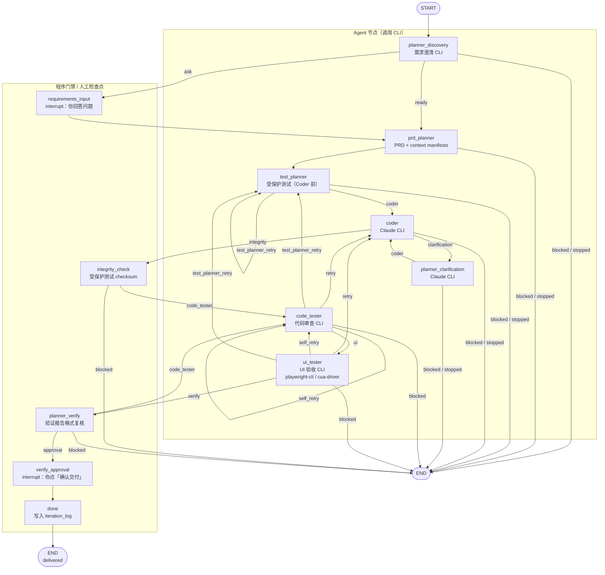
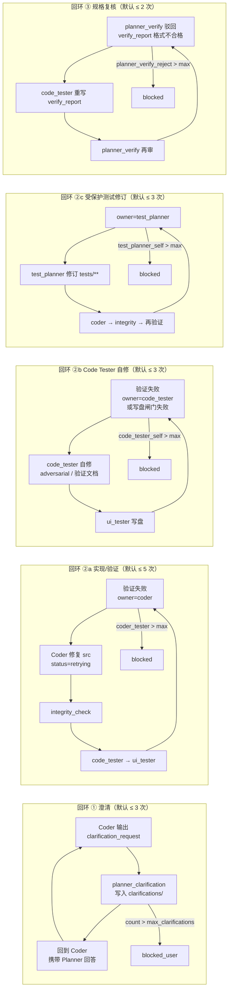
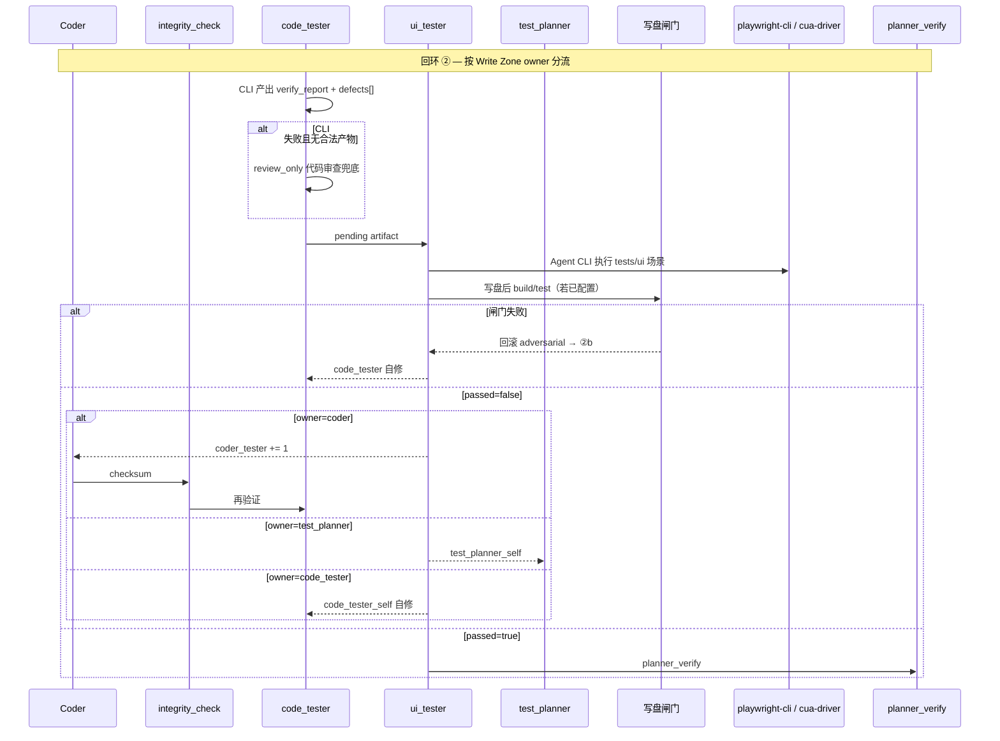
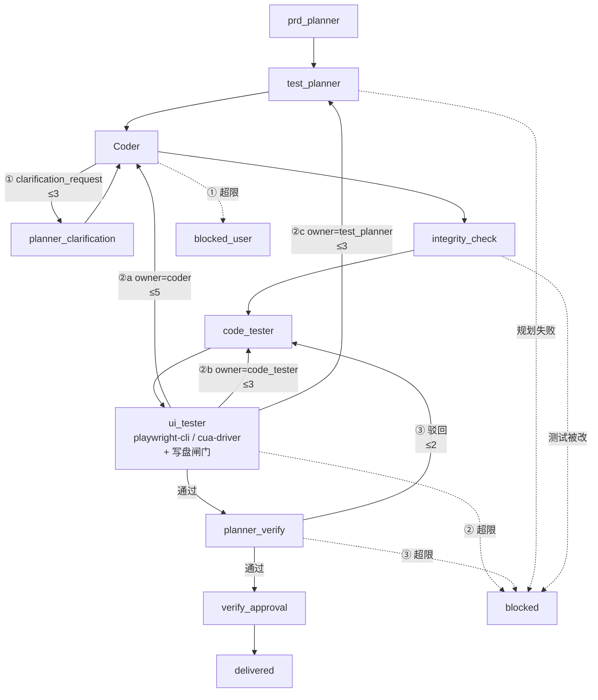

# SpecForge

SpecForge 是一个**本地优先**的 agent 工程工作台。你用自然语言描述一个大需求，系统会自动跑一条「需求澄清 → PRD 规划 → 测试规划 → 实现 → 验证」流水线，把结果写进文档和代码，并在关键节点请你确认。

一句话理解：**文档是事实源，测试先于实现，PRD/测试/实现/验证分角色、分模型，人类只在最后拍板。**

---

## 这套系统在解决什么问题

普通 coding agent 的问题往往是：

- 聊天记录里说了什么，过一会儿就找不到
- 同一个模型又写代码又验代码，容易「自己骗自己」
- 人得全程盯着，不知道现在卡在哪一步

SpecForge 的做法是：

1. **所有决策和产物都落到本地 Markdown 文件**，可以 git 管理
2. **PRD Planner、Test Planner、Coder、Code Tester 分工**（规划多用 Claude，验证可用 Codex，可在项目里按阶段配置）
3. **Test Planner 在 Coder 之前写受保护测试**，Coder 不能改 `tests/unit|integration|ui`（checksum 门禁）
4. **Code Tester 做代码审查；UI Tester Agent 在 `ui_tester` 节点跑验收场景**（playwright-cli / cua-driver，与代码验证分离）
5. **LangGraph 编排整条流水线**，失败按 Write Zone 自动回环，超限才阻断
6. **React 工作台实时展示**当前阶段、Agent 活动、CLI 输出

---

## 核心概念（从外到内）

```text
Project（项目）
  └── Epic（大需求）
        └── Iteration（一次流水线运行）
              ├── 文档与测试（docs/）
              ├── 代码工作区（.specforge/iterations/.../src/）
              ├── 事件与日志（SQLite）
              └── LangGraph 状态（checkpoint）
```

| 概念 | 是什么 | 举例 |
|------|--------|------|
| **Project** | 绑定到你电脑上的一个代码仓库目录 | `~/Projects/my-app` |
| **Epic** | 一条大需求：标题、描述、验收标准 | 「给仪表盘加导出 CSV 功能」 |
| **Iteration** | Epic 对应的一次完整流水线执行 | 从规划跑到交付（或失败/停止） |

当前规则：**一个大需求（Epic）对应一条流水线（Iteration）**，侧边栏里一行就是一个 Epic + 其运行状态。

---

## 磁盘上文件放哪

假设项目根目录是 `/path/to/my-app`：

```text
/path/to/my-app/
├── docs/                              # 项目级文档（事实源）
│   ├── 00_convention.md               # 项目布局约定（短 stub，由 PRD Planner 扩写）
│   ├── 01_project_goal.md             # 项目目标（创建时种子，可再由 Agent 维护）
│   ├── 02_iteration_log.md            # 迭代日志（程序追加审计）
│   ├── spec/                          # 包级规范（Agent 按需创建）
│   ├── 03_invariants/                 # 不变量（Agent 按需创建）
│   ├── 04_decisions/                  # 项目 ADR（Agent 按需创建）
│   └── iterations/
│       └── iteration_001/             # 第 1 轮迭代的产物
│           ├── prd.md                 # PRD（需求、验收标准、架构边界）
│           ├── testing_plan.md
│           ├── context/               # for_coder.jsonl / for_tester.jsonl（prd_planner 必填，test_planner 追加测试路径）
│           ├── verify_report.md
│           ├── delivery_advice.md
│           ├── clarifications/        # Coder 提问 / Planner 澄清回答
│           └── tests/
│               ├── unit/
│               ├── integration/
│               ├── ui/
│               └── adversarial/
└── .specforge/
    ├── skills/                        # 可选：按环节追加团队规程（见下文）
    │   ├── prd_planner/extra.md
    │   ├── test_planner/extra.md
    │   ├── coder/extra.md
    │   └── code_tester/extra.md
    └── iterations/
        └── iter_abc123/               # 本轮代码工作区
            ├── src/                   # Coder 只改这里
            └── .specforge/schemas/    # CLI JSON schema 缓存
```

创建 Project 时仅初始化目录与少量种子文件（`00_convention` 短 stub、`01_project_goal`）；SpecForge 框架规则（写区、UI 测试格式）通过 prompt 注入，不写入用户仓库。每次 Iteration 启动时创建 `docs/iterations/iteration_NNN/` 目录树，产物由 Agent 生成、程序校验落盘。

### 项目级 Stage Skills（可选）

内置规程在 SpecForge 后端 [`backend/prompts/stages/`](backend/prompts/stages/)，**每次 CLI 调用由程序组装进 prompt**（不依赖 Claude/Codex 自动发现 skills 目录）。

若需为本仓库追加环节说明，在绑定项目根目录创建（创建 Project 时会建好空目录）：

```text
.specforge/skills/prd_planner/extra.md
.specforge/skills/test_planner/extra.md
.specforge/skills/coder/extra.md
.specforge/skills/code_tester/extra.md
```

`extra.md` 为纯 Markdown，无需 YAML frontmatter。示例（`prd_planner/extra.md`）：

```markdown
## Team conventions

- Use `pnpm` for all Node commands.
- Read `docs/spec/api/` before changing public HTTP handlers.
```

### 写权限分区（Write Zones）

各阶段只能改特定路径；后端在 `policy/write_zones.py` 中按路径推断 **owner**，验证失败时按 owner 选择回环目标（而非一律回 Coder）。

| 分区 | 路径模式 | Owner | 说明 |
|------|----------|-------|------|
| 源码 | `src/**`（或 convention 中的 `internal/`、`lib/` 等） | **Coder** | 实现代码 |
| 受保护测试 | `tests/unit`、`tests/integration`、`tests/ui` | **Test Planner** | checksum 基线，Coder/Code Tester 不可改 |
| 对抗测试 | `tests/adversarial/**` | **Code Tester** | Code Tester 可增删 |
| 验证产物 | `verify_report.md`、`delivery_advice.md`、`ui_*` | **Code Tester** | 验证与交付文档（由 code_tester + ui_tester 写盘） |
| PRD | `prd.md` | **PRD Planner** | 产品与实现范围 |
| 测试计划 | `testing_plan.md` | **Test Planner** | 测试策略 |

项目可在 `docs/00_convention.md` 中声明源码根目录、测试布局与 import 约定（PRD Planner 应在首轮替换默认 stub）；各阶段 prompt 会注入该文件摘要及 [`backend/prompts/framework_conventions.md`](backend/prompts/framework_conventions.md) 中的框架规则。

---

## 流水线怎么跑（通俗版）

你可以把整个流程想成一条工厂流水线：**需求澄清** → **PRD 规划**（`prd_planner`）→ **测试规划**（`test_planner`，在 Coder 之前写受保护测试）→ **实现** → **代码验证 + UI 验证** → **规格复核** → 你签字交付。下图对应 LangGraph 的真实边（见 `pipeline/graph.py` 的 `_build_graph` 与 `pipeline/routes.py` 的条件路由）。



**图例：** 实线 = LangGraph 边；边上标签 = `_route_after_*` 返回值（与 `routes.py` 一致）。七个 **Agent 节点**均通过 CLI 调用外部模型；`ui_tester` 在 prompt 中路由 **playwright-cli**（`kind: web`）与 **cua-driver**（`kind: native`）。`integrity_check`、`planner_verify`、`done` 为后端程序节点，不调用 CLI。规划阶段只落盘 `prd.md` 与 `testing_plan.md`（位于 `docs/iterations/iteration_NNN/`）。

### LangGraph 状态机（开发者）

| 节点 | 类型 | 说明 |
|------|------|------|
| `planner_discovery` | CLI | 需求澄清；`route=ask` 时进入人工输入 |
| `requirements_input` | interrupt | 用户回答 discovery 问题 |
| `prd_planner` | CLI | PRD + context manifests |
| `test_planner` | CLI | 测试计划 + 受保护测试 |
| `coder` | CLI | 实现 `src/**` |
| `planner_clarification` | CLI | 回答 Coder 澄清 |
| `integrity_check` | 程序 | 受保护测试 checksum |
| `code_tester` | CLI | 代码审查、`defects[]`、对抗测试 |
| `ui_tester` | CLI | UI 场景 + 写盘闸门（build/test） |
| `planner_verify` | 程序 | 验证报告格式复核 |
| `verify_approval` | interrupt | 用户确认交付 |
| `done` | 程序 | 归档 `delivered` |

**条件边（`pipeline/routes.py` → `pipeline/graph.py`）：**

| 源节点 | 路由函数 | 可能目标 |
|--------|----------|----------|
| `planner_discovery` | `_route_after_discovery` | `blocked`→END，`ask`→`requirements_input`，`ready`→`prd_planner` |
| `prd_planner` | `_route_after_prd_planner` | `blocked`→END，`test_planner` |
| `test_planner` | `_route_after_test_planner` | `blocked`→END，`coder`，`test_planner_retry`→自身 |
| `coder` | `_route_after_coder` | `blocked`→END，`clarification`→`planner_clarification`，`integrity`→`integrity_check` |
| `planner_clarification` | `_route_after_clarification` | `blocked`→END，`coder` |
| `integrity_check` | `_route_after_integrity` | `blocked`→END，`code_tester` |
| `code_tester` | `_route_after_code_tester` | `blocked`→END，`ui`→`ui_tester`，`retry`→`coder`，`self_retry`→自身，`test_planner_retry`→`test_planner` |
| `ui_tester` | `_route_after_ui_tester` | `blocked`→END，`retry`→`coder`，`self_retry`→`code_tester`，`test_planner_retry`→`test_planner`，`verify`→`planner_verify` |
| `planner_verify` | `_route_after_planner_verify` | `blocked`→END，`code_tester`（驳回），`approval`→`verify_approval` |

`LangGraphPipeline` 定义于 `pipeline/orchestrator.py`（MRO：Planning → Implementation → Verification → UiTester → Artifacts → Prompts → Routes → Graph → Runtime）。

### 各步骤在干什么

| 阶段 | 节点 | 谁在做 | 做什么 |
|------|------|--------|--------|
| 需求澄清 | `planner_discovery` | Claude CLI | 在终局规划前澄清模糊需求（auto：清晰则直接 ready，否则一次一问） |
| 需求回答 | `requirements_input` | **你** | 在工作台回答 Planner 问题；写入 `discovery/*` |
| PRD 规划 | `prd_planner` | Claude CLI | 产出 `prd.md` 与 context manifests |
| 测试规划 | `test_planner` | Claude CLI | 产出 `testing_plan.md` 与受保护 `tests/**`（建立 checksum 基线） |
| 实现 | `coder` | Claude CLI | 只改 `src/**`，根据规划写代码 |
| 澄清 | `planner_clarification` | Claude CLI | Coder 看不懂时，Planner 正式回答并写入 `clarifications/` |
| 完整性 | `integrity_check` | 后端程序 | 检查 Test Planner 写的测试有没有被 Coder 偷偷改掉 |
| 代码验证 | `code_tester` | Codex/Claude CLI | 独立代码审查与测试命令；写 `verify_report.md` 与 `defects[]`（不调用 UI 自动化） |
| UI 验证 | `ui_tester` | Claude/Codex CLI | Agent 执行 `tests/ui/*.json`（web → playwright-cli，native → cua-driver），合并验证产物并写盘 |
| 复核 | `planner_verify` | 后端程序 | 检查验证报告格式是否合格 |
| 交付确认 | `verify_approval` | **你** | 在前端点「确认交付」，流水线才归档 |
| 完成 | `done` | 后端 | 状态变为 `delivered`，写入 iteration_log |

**注意：** 规划分两阶段：**prd_planner**（PRD + context）→ **test_planner**（测试计划 + 受保护测试），之后才进入 Coder。需求澄清仍是一次一问；回答后不再额外跑 discovery CLI。无单独的设计审批节点，**不生成** `system_design.md` / `modification_plan.md`，事实源为 `prd.md` 与 `testing_plan.md`。交付前仍有**最终确认**。Coder 仍可通过 `planner_clarification` 向规划侧补问（与 discovery 分离）。

### 工作台阶段条（前端）

侧边栏与宏观流程图按下列 **9 个步骤** 展示（与 LangGraph 节点一一对应，不再合并为单一「规划」）：

| 步骤 | 对应节点 | 说明 |
|------|----------|------|
| PRD 规划 | `planner_discovery`、`requirements_input`、`prd_planner` | 需求澄清 + `prd.md` + context manifests |
| 测试规划 | `test_planner` | `testing_plan.md` + 受保护 `tests/**` |
| 实现 | `coder`、`planner_clarification` | 写 `src/**`；澄清回合计入实现阶段 |
| 测试完整性 | `integrity_check` | 受保护测试 checksum |
| 代码验证 | `code_tester` | 独立审查、`verify_report`、`defects[]` |
| UI 验证 | `ui_tester` | playwright-cli / cua-driver Agent + 写盘闸门 |
| 规格复核 | `planner_verify` | 验证报告格式 |
| 交付确认 | `verify_approval` | 人工确认 |
| 交付完成 | `done` | `delivered` |

---

## 自动回环（失败怎么办）

系统**不会无限重试**。每条回环独立计数（存在 `iteration.retry_counts`），超限后流水线进入 `blocked` 或 `blocked_user`，需你查看事件流 / 运行日志后人工处理。

验证失败时，流水线先根据 Code Tester / UI Tester 合并产出的 **`defects[]`（结构化缺陷）** 与各缺陷路径的 **Write Zone owner** 决定回跳目标；不再把所有 `passed=false` 一律送回 Coder。



各回环的触发条件与计数键对照：

| 回环 | 计数键 `retry_counts` | 默认上限 | 入口条件 | 回跳路径 | 超限终态 |
|------|----------------------|----------|----------|----------|----------|
| **① 澄清** | `coder_planner_clarify` | 3 | Coder artifact 含 `clarification_request` | `coder → planner_clarification → coder` | `blocked_user` |
| **②a 实现/验证** | `coder_tester` | 5 | `defects` 含 `owner=coder`（如 `src/**` 实现缺陷），或审查兜底失败且推断为 Coder 责任 | `ui_tester → coder → integrity_check → code_tester → ui_tester` | `blocked` |
| **②b Code Tester 自修** | `code_tester_self` | 3 | `defects` 仅 `owner=code_tester`（如 `tests/adversarial/**`、验证文档），或写盘闸门失败 | `code_tester → code_tester`（带 `failure_notes`） | `blocked` |
| **②c 测试修订** | `test_planner_self` | 3 | `defects` 含 `owner=test_planner` / 受保护 `tests/**` 问题 | `ui_tester → test_planner → coder → …` | `blocked` |
| **③ 规格复核** | `planner_verify_reject` | 2 | `verify_report.md` 缺少标题或 Pass 摘要 | `planner_verify → code_tester → ui_tester → planner_verify` | `blocked` |

**owner=prd_planner**（PRD 范围硬冲突等）不进入自动回环，直接 `blocked`，需人工处理。

**UI Tester**（`ui_tester` CLI 阶段）扫描 `docs/.../tests/ui/*.json`：`kind: web` 用 **playwright-cli**（`open` → `snapshot` → `click eN`）；`kind: native` 用 **cua-driver**（`launch_app` → `get_window_state` → `element_index`）。本机 CUA 会话互斥时 native 可记 `warning`。**UI 断言失败不触发 ②a/②b/②c**，只写入 `ui_warnings` 与交付建议。

**Code Tester 容错（`code_tester` 节点；UI 在后续 `ui_tester`）：**

| 情况 | 行为 |
|------|------|
| CLI 非零退出，但 stdout 含合法 JSON 产物 | 接受产物，发 `code_tester.nonzero_artifact.accepted` |
| CLI 非零退出且无合法产物 | **代码审查兜底**（`review_only`，禁止 Playwright/CUA），发 `code_tester.review_fallback.*` |
| 审查兜底成功 | 进入 `ui_tester` → `planner_verify` |
| 审查兜底也失败 | 按 `defects`/owner 进入 ②a / ②b / ②c |
| 写盘后 `build_command` / `test_command` 失败 | 回滚 adversarial，以 `owner=code_tester` 进入 **②b** |
| UI 自动化断言失败 | `ui_tester.failed`（`blocking: false`）；是否通过以 Code Tester 代码审查无 P0/P1 为准 |



**与主流程图的关系：** 回环 ① 在 `coder` ↔ `planner_clarification`；②a 经 `integrity_check → code_tester → ui_tester`；②b 在 `code_tester` 自修；②c 回到 `test_planner`；③ 在 `planner_verify` 与 `code_tester` 之间。

下面把各回环叠在同一条主骨架上（边上标注 ①②a②b③ 与默认上限）：



> 带 ①②a②b②c③ 的实线为自动回跳。前端按 `retry_target` 显示「回到实现」「Code Tester 自修」「修订受保护测试」等文案。

---

## 停止与恢复

- **停止**：工作台点「停止」→ 后端立刻 kill 正在跑的 CLI 进程，记录停在哪个步骤（`stopped_at_node`）
- **继续执行**：状态为 `stopped` 时，点「继续执行」→ 从 `stopped_at_node` 恢复（例如停在 `test_planner` 就重跑测试规划）

删除流水线时也会先停止所有正在运行的 Agent CLI。

---

## 实时界面怎么工作

前端通过 **WebSocket** 订阅当前 Iteration：

```text
浏览器 ──WebSocket──► 后端 EventBroker
                         ▲
                         │ snapshot / cli.output 事件
                    Pipeline Worker（后台线程跑 LangGraph）
```

你在界面上能看到：

- **流水线阶段条**：PRD 规划 / 测试规划 / 实现 / 测试完整性 / 代码验证 / UI 验证 / 规格复核 / 交付确认 / 交付完成（可点击回顾各阶段历史）
- **Agent 活动**：语义化事件（`prd_planner.completed`、`test_planner.completed`、`code_tester.retry_to_coder` 等，无旧版 `planner`/`tester` 节点别名）
- **本阶段 CLI 日志**：各阶段 CLI 的实时终端输出（stream-json 原始流）
- **文档面板**：`prd.md`、`testing_plan.md`、`verify_report.md` 等
- **运行日志**：每个节点 CLI 的完整 stdout/stderr 归档
- **UI 验证面板**：`ui_results.json` / `ui_report.md`；UI 失败时显示警告而非阻断

---

## 流水线角色（LangGraph 节点）

| 节点 | 运行时 | 职责 | 主要 Write Zone |
|------|--------|------|-----------------|
| **planner_discovery** | Claude CLI | 需求澄清（一次一问或 ready） | `discovery/*` |
| **prd_planner** | Claude CLI | 产出 `prd.md`、context manifests | `prd.md`、`context/for_*.jsonl` |
| **test_planner** | Claude CLI | 产出 `testing_plan.md`、受保护 `tests/**` | `testing_plan.md`、`tests/unit|integration|ui` |
| **coder** | Claude CLI | 按 PRD/测试实现 | `src/**`（及 convention 中的源码根） |
| **planner_clarification** | Claude CLI | 回答 Coder 澄清 | `clarifications/*` |
| **code_tester** | Codex/Claude CLI（可配置） | 独立代码审查、`defects[]`、对抗测试；无 UI 自动化 | `verify_report.md`、`delivery_advice.md`、`tests/adversarial/` |
| **ui_tester** | Claude/Codex CLI（可配置） | Agent 执行 `tests/ui/*.json`（playwright-cli / cua-driver）、合并验证产物、写盘闸门 | `ui_results.json`、`ui_report.md`（在 code_tester 产物基础上） |

反串谋：规划与验证可分模型；受保护测试在 Coder **之前**由 Test Planner 写入并建立 checksum；Code Tester 不得改 protected tests。验证回环按 owner 分流：Coder（②a）、Code Tester 自修（②b）、Test Planner 修订测试（②c）。UI 环境不可用走 code_tester 审查兜底；UI 断言失败仅警告，不单独触发实现回环。

---

## 后端架构（给开发者）

```text
FastAPI (main.py — HTTP + WebSocket)
    │
    ├── storage/db          SQLite：projects / epics / iterations / events / runs
    ├── pipeline/           LangGraph 状态机 + SqliteSaver checkpoint
    │   ├── graph.py        节点与边
    │   └── routes.py       条件路由（ui_tester：retry | self_retry | test_planner_retry | verify）
    ├── policy/write_zones  路径 → owner，决定 retry_target
    ├── policy/artifact_gate 写盘后 build/test 命令校验
    ├── runtime/job_queue   单 worker 线程，避免 CLI 阻塞 HTTP
    └── runtime/events      EventBroker → WebSocket snapshot / cli.output
```

创建 Iteration 时：`POST /api/iterations` → 入队 → worker 调用 `pipeline.start()` → LangGraph 从 `planner_discovery` 开始跑。

---

## 快速启动

需要 **Python 3.12+** 和 **Node.js**。

```bash
conda activate computer-use-py312   # 或任意 Python 3.12 环境

# 一键启动前后端
cd frontend && npm install && npm run dev:all
```

或：

```bash
./scripts/dev.sh
```

打开 http://127.0.0.1:5178 ，后端 API 在 http://127.0.0.1:8787 。

### real-cli 前置条件

默认 **real-cli** 模式，需要本地已安装：

- `claude` — 默认用于 `prd_planner`、`test_planner`、`coder`、discovery/clarification
- `codex` — 默认用于 `code_tester`（可在项目 **CLI 绑定** 里按阶段改为 Claude）

CLI 使用 `bypassPermissions` / `--dangerously-bypass-approvals-and-sandbox` 跳过交互式权限确认。测试不可变靠 `test_planner` 写基线 + `integrity_check` 保障。

可选 UI 验收（**`ui_tester`** CLI Agent）：

| UI spec `kind` | Agent 工具链 |
|----------------|--------------|
| `web` | **playwright-cli**（`backend/prompts/skills/playwright/scripts/playwright_cli.sh` 包装 `npx @playwright/cli`） |
| `native` | **cua-driver** CLI（与 computer-use `--host` 相同；禁止 `open -a` 抢焦点） |

**Cua 全局单会话**：本机同时只允许一个 CUA UI 会话（文件锁 `.specforge/cua-driver.session.lock`）。锁被占用时 native 场景记为 `warning`，不阻断交付，依赖 Code Tester 代码审查结论。

```bash
npx --yes --package @playwright/cli playwright-cli install-browser
python computer-use/backend/install_cua_driver.py
```

`./scripts/dev.sh` 默认安装 playwright-cli 浏览器并运行 CuaDriver 安装器。`SPECFORGE_SKIP_UI=1` / `SPECFORGE_SKIP_CUA=1` 可跳过。

`GET /api/health` includes `ui.playwright`, `ui.cua`, `ui.cua_session` (`idle` or `busy:<iteration_id>`), and install hints.

---

## 基本使用步骤

1. **创建 Project** — 绑定本地文件夹
2. **创建 Epic（大需求）** — 填写描述和验收标准
3. **启动流水线** — 系统自动创建 Iteration 并开始规划
4. **观察执行** — 看阶段条、Agent 活动、CLI 实时日志
5. **等待验证通过** — 按 Write Zone 分流：Coder 修 `src`、Code Tester 自修验证产物、或 Test Planner 修订受保护测试；UI 失败项建议人工复核
6. **确认交付** — `verify_report` 就绪后点「确认交付」（UI 警告不阻断）
7. **查看产物** — `docs/iterations/iteration_NNN/`（含 `prd.md`）和 `.specforge/iterations/{id}/src/`

随时可以用「停止」暂停，之后「继续执行」从当前步骤恢复。

---

## 运行模式

| 模式 | 用途 | 行为 |
|------|------|------|
| `real-cli`（默认） | 日常开发 | 调用 Claude / Codex CLI，真实产出 |
| `dry-run` | CI / 测试 | 不调用外部 CLI，生成确定性假数据 |

测试套件通过环境变量 `SPECFORGE_MODE=dry-run` 启用。前端不暴露 dry-run 选项。

---

## 项目可配置项

每个 Project 可设置：

- 默认测试命令（`default_test_command`）与构建命令（`default_build_command`，如 `npm run build`、`cargo check`）
- Coder↔验证 重试上限（`max_coder_tester_retries`，默认 5）
- Code Tester 自修与 Test Planner 测试修订上限（共用 `max_tester_self_retries`，默认 3；计数键分别为 `code_tester_self`、`test_planner_self`）
- 各阶段 CLI 提供商（`planner_discovery`、`prd_planner`、`test_planner`、`planner_clarification`、`coder`、`code_tester`、`ui_tester`；无 `planner`/`tester` 绑定别名）
- Coder 澄清上限（默认 3）
- Planner 验证驳回上限（默认 2）

构建/测试命令在 `ui_tester` 写盘闸门中执行：失败则回滚 adversarial 并进入回环 ②b。

---

## 仓库结构

```text
spec-forge/
├── backend/                    FastAPI + LangGraph + SQLite
│   ├── prompts/stages/         各阶段 SKILL（含 ui_tester）
│   └── src/specforge/
│       ├── main.py             FastAPI 入口（uvicorn specforge.main:app）
│       ├── core/               config、models、contracts
│       ├── storage/            db.py
│       ├── documents/          docs_io、docs_scaffold、project_paths
│       ├── agents/             cli_commands、cli_runner、prompt_loader
│       ├── policy/             write_zones、artifact_gate、context_manifest
│       ├── ui/                 ui_runtime、playwright_cli、cua_*、ui_driver*（legacy 测试）
│       ├── runtime/            events、job_queue
│       ├── pipeline/           LangGraph 编排（graph / routes / orchestrator）
│       │   ├── graph.py          节点与边（状态机真源）
│       │   ├── routes.py         条件路由
│       │   ├── orchestrator.py   LangGraphPipeline 公开 API
│       │   ├── mixins/           runtime、prompts、artifacts、ui_tester
│       │   └── nodes/            planning、implementation、verification
│       └── *.py                兼容 shim（如 contracts.py → core/contracts）
├── frontend/                   React 工作台
│   └── src/features/
│       ├── pipeline/           侧边栏、阶段面板
│       └── iteration/          日志、文档、实时订阅
├── docs/                       本仓库的设计文档
└── scripts/dev.sh              本地启动脚本
```

推荐 import：`from specforge.pipeline import LangGraphPipeline`、`from specforge.core.contracts import ...`。根目录 shim（`from specforge.contracts import ...`）仍可用。

---

## 当前限制

- 单用户本地原型，无登录和多租户
- CLI 权限策略为 bypass 模式，隔离强度有限
- CSS selector Web UI 由 Playwright 执行；CuaDriver 不可用时无 selector 的 Web UI 也可回退 Playwright；仅 native UI 或未安装 Playwright 时记为未执行（warning）
- UI 自动化断言失败仅记为 warning；交付门槛以 Code Tester 代码审查无 P0/P1 缺陷为准
- 迭代产物目录为 `docs/iterations/iteration_NNN/`（旧路径 `docs/system_design/` 已废弃）；API 文档键为 `prd`、`testing_plan` 等，无 `system_design` / `modification_plan` 别名
- 渐进式 checkpoint 策略（前 N 轮强制审批）尚未实现
- 生产部署、成本监控、量化成功标准留待后续

---

## 进一步阅读

- [docs/development_plan.md](docs/development_plan.md) — 开发计划
- [docs/system_design.md](docs/system_design.md) — 本仓库早期内部设计笔记（部分内容已过时，以 README 与 `pipeline/graph.py` 为准）
