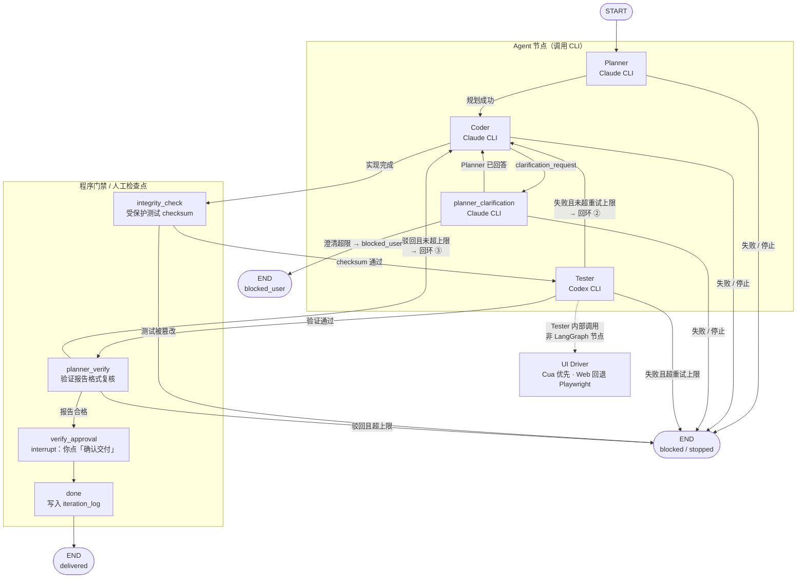
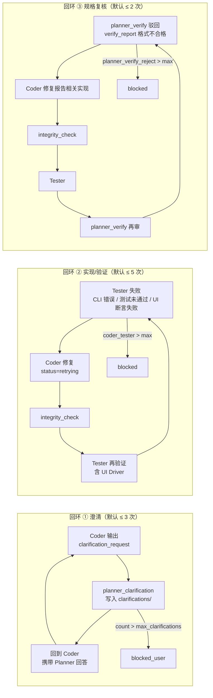
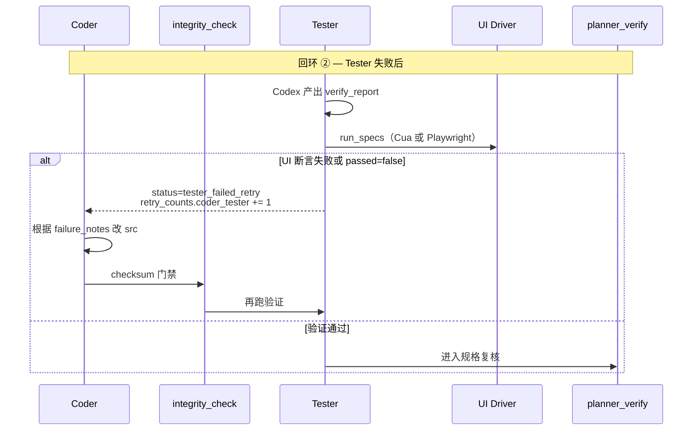
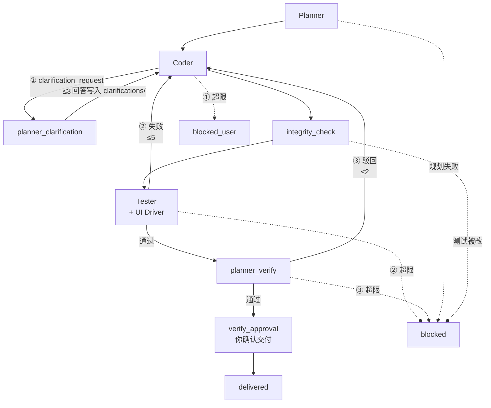

# SpecForge

SpecForge 是一个**本地优先**的 agent 工程工作台。你用自然语言描述一个大需求，系统会自动跑一条「规划 → 实现 → 验证」流水线，把结果写进文档和代码，并在关键节点请你确认。

一句话理解：**文档是事实源，测试先于实现，三个 Agent 互相制衡，人类只在最后拍板。**

---

## 这套系统在解决什么问题

普通 coding agent 的问题往往是：

- 聊天记录里说了什么，过一会儿就找不到
- 同一个模型又写代码又验代码，容易「自己骗自己」
- 人得全程盯着，不知道现在卡在哪一步

SpecForge 的做法是：

1. **所有决策和产物都落到本地 Markdown 文件**，可以 git 管理
2. **Planner、Coder、Tester 分工**，Planner/Coder 用 Claude，Tester 用 Codex（不同模型家族）
3. **Planner 先写测试，Coder 不能改测试**（后端有 checksum 校验）
4. **LangGraph 编排整条流水线**，失败自动重试，超限才阻断
5. **React 工作台实时展示**当前阶段、Agent 活动、CLI 输出

---

## 核心概念（从外到内）

```text
Project（项目）
  └── Epic（大需求）
        └── Iteration（一次流水线运行）
              ├── 文档与测试（docs/）
              ├── 代码工作区（.specforge/iterations/.../src/）
              ├── 事件与日志（SQLite）
              └── LangGraph 状态（checkpoint）
```

| 概念 | 是什么 | 举例 |
|------|--------|------|
| **Project** | 绑定到你电脑上的一个代码仓库目录 | `~/Projects/my-app` |
| **Epic** | 一条大需求：标题、描述、验收标准 | 「给仪表盘加导出 CSV 功能」 |
| **Iteration** | Epic 对应的一次完整流水线执行 | 从规划跑到交付（或失败/停止） |

当前规则：**一个大需求（Epic）对应一条流水线（Iteration）**，侧边栏里一行就是一个 Epic + 其运行状态。

---

## 磁盘上文件放哪

假设项目根目录是 `/path/to/my-app`：

```text
/path/to/my-app/
├── docs/                              # 项目级文档（事实源）
│   ├── 00_convention.md               # 文档约定
│   ├── 01_project_goal.md             # 项目目标
│   ├── 02_iteration_log.md            # 迭代日志（自动追加）
│   ├── 03_invariants/                 # 不变量（数据/安全/性能）
│   ├── 04_decisions/                  # ADR 架构决策记录
│   └── system_design/
│       └── iteration_001/             # 第 1 轮迭代的产物
│           ├── system_design.md
│           ├── modification_plan.md
│           ├── testing_plan.md
│           ├── verify_report.md
│           ├── clarifications/        # Coder 提问 / Planner 回答
│           └── tests/
│               ├── unit/
│               ├── integration/
│               ├── ui/
│               └── adversarial/
└── .specforge/
    └── iterations/
        └── iter_abc123/               # 本轮代码工作区
            ├── src/                   # Coder 只改这里
            └── .specforge/schemas/    # CLI JSON schema 缓存
```

创建 Project 时会自动生成 `docs/` 骨架；每次 Iteration 启动时会在 `docs/system_design/iteration_NNN/` 下创建本轮目录。

---

## 流水线怎么跑（通俗版）

你可以把整个流程想成一条工厂流水线：三个 Agent 工人、两个程序门禁、一个规格复核、最后由你签字交付。下图对应 LangGraph 的真实边（见 `pipeline.py` 的 `_build_graph`）。



**图例：** 实线 = LangGraph 边；虚线 = Tester 节点内的工具调用。`integrity_check` 与 `planner_verify` 不调用外部 CLI。

### 各步骤在干什么

| 阶段 | 节点 | 谁在做 | 做什么 |
|------|------|--------|--------|
| 规划 | `planner` | Claude CLI | 读大需求和项目 docs，产出设计/计划/测试文件 |
| 实现 | `coder` | Claude CLI | 只改 `src/**`，根据规划写代码 |
| 澄清 | `planner_clarification` | Claude CLI | Coder 看不懂时，Planner 正式回答并写入 `clarifications/` |
| 完整性 | `integrity_check` | 后端程序 | 检查 Planner 写的测试有没有被 Coder 偷偷改掉 |
| 验证 | `tester` | Codex CLI | 独立跑验证，写 `verify_report.md`，可选 UI 测试 |
| 复核 | `planner_verify` | 后端程序 | 检查验证报告格式是否合格 |
| 交付确认 | `verify_approval` | **你** | 在前端点「确认交付」，流水线才归档 |
| 完成 | `done` | 后端 | 状态变为 `delivered`，写入 iteration_log |

**注意：** 规划完成后**不会**再让你审批设计，会直接进入实现。目前唯一的人工检查点是**最终交付确认**。

---

## 三条自动回环（失败怎么办）

系统**不会无限重试**。每条回环独立计数（存在 `iteration.retry_counts`），超限后流水线进入 `blocked` 或 `blocked_user`，需你查看事件流 / 运行日志后人工处理。



三条回环的触发条件与计数键对照：

| 回环 | 计数键 `retry_counts` | 默认上限 | 入口条件 | 回跳路径 | 超限终态 |
|------|----------------------|----------|----------|----------|----------|
| **① 澄清** | `coder_planner_clarify` | 3 | Coder artifact 含 `clarification_request` | `coder → planner_clarification → coder` | `blocked_user` |
| **② 实现/验证** | `coder_tester` | 5 | Tester CLI 失败、`passed=false`、或 UI `failed` | `tester → coder → integrity_check → tester` | `blocked` |
| **③ 规格复核** | `planner_verify_reject` | 2 | `verify_report.md` 缺少标题或 Pass 摘要 | `planner_verify → coder → integrity_check → tester → planner_verify` | `blocked` |

回环 ② 中 **UI Driver** 在 `tester` 节点内执行（扫描 `docs/.../tests/ui/*.json`）：Cua 可用则走 CuaDriver；Cua 不可用时 **Web** trajectory 由 Playwright 真实执行；**native** 仍记为未执行（`warning`），不单独占一条 LangGraph 边。



**与主流程图的关系：** 回环 ① 只发生在 `coder` 与 `planner_clarification` 之间；回环 ②③ 都从 `coder` 重新进入，且**必须经过** `integrity_check → tester`（③ 还要多一次 `planner_verify`）。

下面把三条回环叠在同一条主骨架上（边上标注 ①②③ 与默认上限）：



> 带 ①②③ 的实线为自动回跳；虚线指向 `blocked` / `blocked_user` 为超限或硬失败。任意节点还可因你点击「停止」进入 `stopped`；点「继续执行」从 `stopped_at_node` 恢复，不消耗回环计数。

---

## 停止与恢复

- **停止**：工作台点「停止」→ 后端立刻 kill 正在跑的 CLI 进程，记录停在哪个步骤（`stopped_at_node`）
- **继续执行**：状态为 `stopped` 时，点「继续执行」→ 从停止的那个步骤重新跑（例如停在规划就重跑 Planner）

删除流水线时也会先停止所有正在运行的 Agent CLI。

---

## 实时界面怎么工作

前端通过 **WebSocket** 订阅当前 Iteration：

```text
浏览器 ──WebSocket──► 后端 EventBroker
                         ▲
                         │ snapshot / cli.output 事件
                    Pipeline Worker（后台线程跑 LangGraph）
```

你在界面上能看到：

- **流水线阶段条**：规划 / 实现 / 测试 / 交付确认
- **Agent 活动**：语义化事件（「规划节点已启动」「已收到模型输出」…）
- **本阶段 CLI 日志**：Planner/Coder/Tester 的实时终端输出（stream-json 原始流）
- **文档面板**：`system_design.md` 等产物
- **运行日志**：每个节点 CLI 的完整 stdout/stderr 归档

---

## 四个 Agent 角色（对应原始设计）

| 角色 | 运行时 | 职责 | 能写什么 |
|------|--------|------|----------|
| **Node 1 Planner** | Claude CLI | 读需求、写 spec、写 protected tests | `docs/system_design/iteration_NNN/` 下的规划和测试 |
| **Node 2 Coder** | Claude CLI | 根据 spec 写代码 | `.specforge/iterations/{id}/src/**` |
| **Node 3 Tester** | Codex CLI | 独立验证、写报告 | `verify_report.md`、`tests/adversarial/` |
| **Node 4 UI Driver** | CuaDriver CLI（Web 可回退 Playwright） | 跑 UI trajectory | 由 Tester 内部调用，不是独立图节点 |

反串谋设计：Planner 和 Tester 用不同模型；测试文件有 checksum 保护；Tester 可以额外写 adversarial 测试。

---

## 后端架构（给开发者）

```text
FastAPI (HTTP + WebSocket)
    │
    ├── SQLite          业务数据：projects / epics / iterations / events / runs
    ├── LangGraph       流水线状态机 + SqliteSaver checkpoint
    ├── Job Queue       单 worker 线程，避免 CLI 阻塞 HTTP
    └── EventBroker     推 snapshot 和 cli.output 到 WebSocket
```

创建 Iteration 时：`POST /api/iterations` → 入队 → worker 调用 `pipeline.start()` → LangGraph 从 `planner` 节点开始跑。

---

## 快速启动

需要 **Python 3.12+** 和 **Node.js**。

```bash
conda activate computer-use-py312   # 或任意 Python 3.12 环境

# 一键启动前后端
cd frontend && npm install && npm run dev:all
```

或：

```bash
./scripts/dev.sh
```

打开 http://127.0.0.1:5178 ，后端 API 在 http://127.0.0.1:8787 。

### real-cli 前置条件

默认 **real-cli** 模式，需要本地已安装：

- `claude` — Planner 和 Coder
- `codex` — Tester

CLI 使用 `bypassPermissions` / `--dangerously-bypass-approvals-and-sandbox` 跳过交互式权限确认。测试不可变主要靠后端 `integrity_check` 保障，而非 CLI 目录 deny。

可选 UI 测试优先使用 `cua-driver`（CuaDriver）；Cua 不可用时 Web UI 自动回退 Playwright：

```bash
pip install -e "backend/.[ui]" && playwright install chromium
```

---

## 基本使用步骤

1. **创建 Project** — 绑定本地文件夹
2. **创建 Epic（大需求）** — 填写描述和验收标准
3. **启动流水线** — 系统自动创建 Iteration 并开始规划
4. **观察执行** — 看阶段条、Agent 活动、CLI 实时日志
5. **等待验证通过** — Coder/Tester 自动回环修复
6. **确认交付** — 验证报告就绪后，点「确认交付」
7. **查看产物** — `docs/system_design/iteration_NNN/` 和 `src/`

随时可以用「停止」暂停，之后「继续执行」从当前步骤恢复。

---

## 运行模式

| 模式 | 用途 | 行为 |
|------|------|------|
| `real-cli`（默认） | 日常开发 | 调用 Claude / Codex CLI，真实产出 |
| `dry-run` | CI / 测试 | 不调用外部 CLI，生成确定性假数据 |

测试套件通过环境变量 `SPECFORGE_MODE=dry-run` 启用。前端不暴露 dry-run 选项。

---

## 项目可配置项

每个 Project 可设置：

- 默认测试命令
- Coder↔Tester 重试上限（默认 5）
- Coder 澄清上限（默认 3）
- Planner 验证驳回上限（默认 2）

---

## 仓库结构

```text
spec-forge/
├── backend/              FastAPI + LangGraph + SQLite
│   └── src/specforge/
│       ├── pipeline.py   流水线状态机（核心）
│       ├── docs_scaffold.py  文档树初始化
│       ├── cli_runner.py     CLI 进程管理
│       └── ...
├── frontend/             React 工作台
│   └── src/features/
│       ├── pipeline/     侧边栏、阶段面板
│       └── iteration/    日志、文档、实时订阅
├── docs/                 本仓库的设计文档
└── scripts/dev.sh        本地启动脚本
```

---

## 当前限制

- 单用户本地原型，无登录和多租户
- CLI 权限策略为 bypass 模式，隔离强度有限
- CuaDriver 不可用时 Web UI 由 Playwright 执行；仅 native UI 或未安装 Playwright 时记为未执行（warning）
- 渐进式 checkpoint 策略（前 N 轮强制审批）尚未实现
- 生产部署、成本监控、量化成功标准留待后续

---

## 进一步阅读

- [docs/system_design.md](docs/system_design.md) — 内部系统设计（版本化）
- [docs/development_plan.md](docs/development_plan.md) — 开发计划
