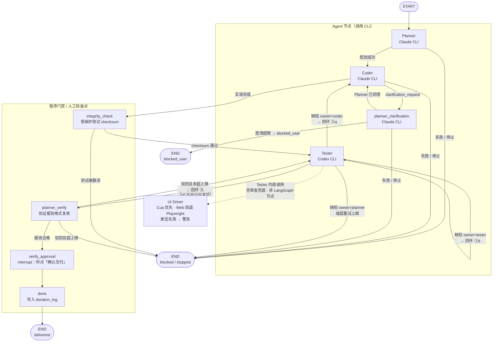
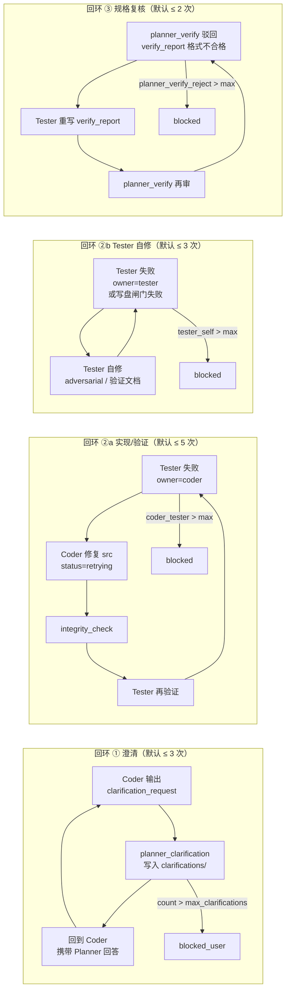
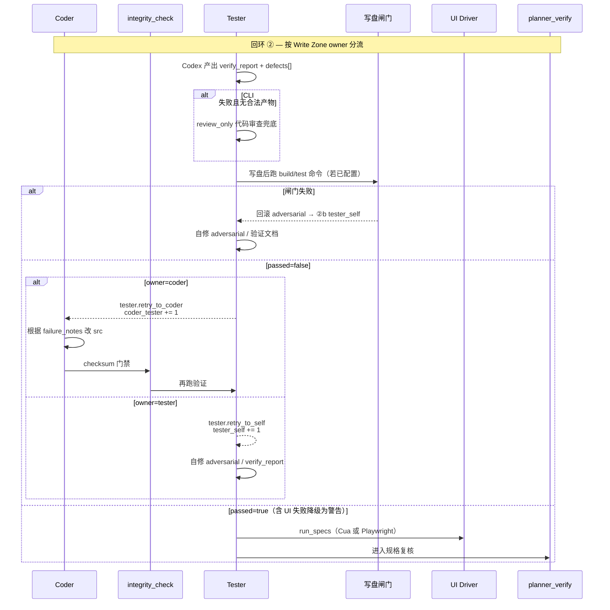
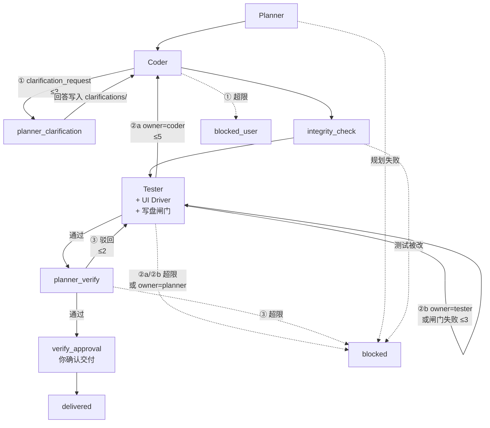

# SpecForge

SpecForge 是一个**本地优先**的 agent 工程工作台。你用自然语言描述一个大需求，系统会自动跑一条「规划 → 实现 → 验证」流水线，把结果写进文档和代码，并在关键节点请你确认。

一句话理解：**文档是事实源，测试先于实现，三个 Agent 互相制衡，人类只在最后拍板。**

---

## 这套系统在解决什么问题

普通 coding agent 的问题往往是：

- 聊天记录里说了什么，过一会儿就找不到
- 同一个模型又写代码又验代码，容易「自己骗自己」
- 人得全程盯着，不知道现在卡在哪一步

SpecForge 的做法是：

1. **所有决策和产物都落到本地 Markdown 文件**，可以 git 管理
2. **Planner、Coder、Tester 分工**，Planner/Coder 用 Claude，Tester 用 Codex（不同模型家族）
3. **Planner 先写测试，Coder 不能改测试**（后端有 checksum 校验）
4. **LangGraph 编排整条流水线**，失败自动重试，超限才阻断
5. **React 工作台实时展示**当前阶段、Agent 活动、CLI 输出

---

## 核心概念（从外到内）

```text
Project（项目）
  └── Epic（大需求）
        └── Iteration（一次流水线运行）
              ├── 文档与测试（docs/）
              ├── 代码工作区（.specforge/iterations/.../src/）
              ├── 事件与日志（SQLite）
              └── LangGraph 状态（checkpoint）
```

| 概念 | 是什么 | 举例 |
|------|--------|------|
| **Project** | 绑定到你电脑上的一个代码仓库目录 | `~/Projects/my-app` |
| **Epic** | 一条大需求：标题、描述、验收标准 | 「给仪表盘加导出 CSV 功能」 |
| **Iteration** | Epic 对应的一次完整流水线执行 | 从规划跑到交付（或失败/停止） |

当前规则：**一个大需求（Epic）对应一条流水线（Iteration）**，侧边栏里一行就是一个 Epic + 其运行状态。

---

## 磁盘上文件放哪

假设项目根目录是 `/path/to/my-app`：

```text
/path/to/my-app/
├── docs/                              # 项目级文档（事实源）
│   ├── 00_convention.md               # 项目布局约定（短 stub，由 Planner 扩写）
│   ├── 01_project_goal.md             # 项目目标（创建时种子，可再由 Agent 维护）
│   ├── 02_iteration_log.md            # 迭代日志（程序追加审计）
│   ├── spec/                          # 包级规范（Agent 按需创建）
│   ├── 03_invariants/                 # 不变量（Agent 按需创建）
│   ├── 04_decisions/                  # 项目 ADR（Agent 按需创建）
│   └── system_design/
│       └── iteration_001/             # 第 1 轮迭代的产物
│           ├── system_design.md
│           ├── modification_plan.md
│           ├── testing_plan.md
│           ├── context/               # for_coder.jsonl / for_tester.jsonl（Planner 必填）
│           ├── verify_report.md
│           ├── clarifications/        # Coder 提问 / Planner 回答
│           └── tests/
│               ├── unit/
│               ├── integration/
│               ├── ui/
│               └── adversarial/
└── .specforge/
    ├── skills/                        # 可选：按环节追加团队规程（见下文）
    │   ├── planner/extra.md
    │   ├── coder/extra.md
    │   └── tester/extra.md
    └── iterations/
        └── iter_abc123/               # 本轮代码工作区
            ├── src/                   # Coder 只改这里
            └── .specforge/schemas/    # CLI JSON schema 缓存
```

创建 Project 时仅初始化目录与少量种子文件（`00_convention` 短 stub、`01_project_goal`）；SpecForge 框架规则（写区、UI 测试格式）通过 prompt 注入，不写入用户仓库。每次 Iteration 启动时创建 `docs/system_design/iteration_NNN/` 目录树，产物由 Agent 生成、程序校验落盘。

### 项目级 Stage Skills（可选）

内置规程在 SpecForge 后端 [`backend/prompts/stages/`](backend/prompts/stages/)，**每次 CLI 调用由程序组装进 prompt**（不依赖 Claude/Codex 自动发现 skills 目录）。

若需为本仓库追加环节说明，在绑定项目根目录创建（创建 Project 时会建好空目录）：

```text
.specforge/skills/planner/extra.md   # 追加到 Planner prompt 末尾
.specforge/skills/coder/extra.md
.specforge/skills/tester/extra.md
```

`extra.md` 为纯 Markdown，无需 YAML frontmatter。示例（`planner/extra.md`）：

```markdown
## Team conventions

- Use `pnpm` for all Node commands.
- Read `docs/spec/api/` before changing public HTTP handlers.
```

### 写权限分区（Write Zones）

三个 Agent 各自只能改特定路径；后端在 `write_zones.py` 中按路径推断 **owner**，验证失败时按 owner 选择回环目标（而非一律回 Coder）。

| 分区 | 路径模式 | Owner | 说明 |
|------|----------|-------|------|
| 源码 | `src/**`（或 convention 中的 `internal/`、`lib/` 等） | **Coder** | 实现代码 |
| 受保护测试 | `tests/unit`、`tests/integration`、`tests/ui` | **Planner** | checksum 基线，Coder/Tester 不可改 |
| 对抗测试 | `tests/adversarial/**` | **Tester** | Tester 可增删 |
| 验证产物 | `verify_report.md`、`delivery_advice.md`、`ui_*` | **Tester** | 验证与交付文档 |
| 规划文档 | 其余 `*.md` 规划类文档 | **Planner** | 设计/计划 |

项目可在 `docs/00_convention.md` 中声明源码根目录、测试布局与 import 约定（Planner 应在首轮替换默认 stub）；各阶段 prompt 会注入该文件摘要及 [`backend/prompts/framework_conventions.md`](backend/prompts/framework_conventions.md) 中的框架规则。

---

## 流水线怎么跑（通俗版）

你可以把整个流程想成一条工厂流水线：三个 Agent 工人、两个程序门禁、一个规格复核、最后由你签字交付。下图对应 LangGraph 的真实边（见 `pipeline.py` 的 `_build_graph`）。



**图例：** 实线 = LangGraph 边；虚线 = Tester 节点内的工具调用。`integrity_check` 与 `planner_verify` 不调用外部 CLI。

### 各步骤在干什么

| 阶段 | 节点 | 谁在做 | 做什么 |
|------|------|--------|--------|
| 规划 | `planner` | Claude CLI | 读大需求和项目 docs，产出设计/计划/测试文件 |
| 实现 | `coder` | Claude CLI | 只改 `src/**`，根据规划写代码 |
| 澄清 | `planner_clarification` | Claude CLI | Coder 看不懂时，Planner 正式回答并写入 `clarifications/` |
| 完整性 | `integrity_check` | 后端程序 | 检查 Planner 写的测试有没有被 Coder 偷偷改掉 |
| 验证 | `tester` | Codex CLI | 独立跑验证，写 `verify_report.md` 与 `defects[]`；CLI 异常时可走代码审查兜底；写盘后可选跑 `build_command`/`test_command` 闸门；可选 UI 测试 |
| 复核 | `planner_verify` | 后端程序 | 检查验证报告格式是否合格 |
| 交付确认 | `verify_approval` | **你** | 在前端点「确认交付」，流水线才归档 |
| 完成 | `done` | 后端 | 状态变为 `delivered`，写入 iteration_log |

**注意：** 规划完成后**不会**再让你审批设计，会直接进入实现。目前唯一的人工检查点是**最终交付确认**。

---

## 自动回环（失败怎么办）

系统**不会无限重试**。每条回环独立计数（存在 `iteration.retry_counts`），超限后流水线进入 `blocked` 或 `blocked_user`，需你查看事件流 / 运行日志后人工处理。

验证失败时，流水线先根据 Tester 产出的 **`defects[]`（结构化缺陷）** 与各缺陷路径的 **Write Zone owner** 决定回跳目标；不再把所有 `passed=false` 一律送回 Coder。



各回环的触发条件与计数键对照：

| 回环 | 计数键 `retry_counts` | 默认上限 | 入口条件 | 回跳路径 | 超限终态 |
|------|----------------------|----------|----------|----------|----------|
| **① 澄清** | `coder_planner_clarify` | 3 | Coder artifact 含 `clarification_request` | `coder → planner_clarification → coder` | `blocked_user` |
| **②a 实现/验证** | `coder_tester` | 5 | `defects` 含 `owner=coder`（如 `src/**` 实现缺陷），或审查兜底失败且推断为 Coder 责任 | `tester → coder → integrity_check → tester` | `blocked` |
| **②b Tester 自修** | `tester_self` | 3 | `defects` 仅 `owner=tester`（如 `tests/adversarial/**`、验证文档），或写盘闸门（`build_command`/`test_command`）失败 | `tester → tester`（带 `failure_notes`） | `blocked` |
| **③ 规格复核** | `planner_verify_reject` | 2 | `verify_report.md` 缺少标题或 Pass 摘要 | `planner_verify → tester → planner_verify` | `blocked` |

**owner=planner**（受保护测试被篡改等）不进入自动回环，直接 `blocked`，需人工或重新跑 Planner。

回环 ② 中 **UI Driver** 在 `tester` 节点内执行（扫描 `docs/.../tests/ui/*.json`）：含 CSS `selector` 的 **Web** trajectory 走 Playwright；无 selector 的 Web/native trajectory 优先走 CuaDriver；Cua 不可用时 Web 可回退 Playwright，native 记为未执行（`warning`），不单独占一条 LangGraph 边。**UI 断言失败不会触发回环 ②a/②b**，只写入 `ui_warnings` 和交付建议，界面显示「需复核」。

**Tester 容错（均在 `tester` 节点内，不占 LangGraph 边）：**

| 情况 | 行为 |
|------|------|
| CLI 非零退出，但 stdout 含合法 JSON 产物 | 接受产物，发 `tester.nonzero_artifact.accepted`，异常记为警告 |
| CLI 非零退出且无合法产物 | 自动启动**代码审查兜底**（`review_only`，禁止 Playwright/CUA），发 `tester.review_fallback.*` 事件 |
| 审查兜底成功 | 继续跑 UI Driver，进入 `planner_verify` |
| 审查兜底也失败 | 按 `defects`/路径 owner 进入 ②a 或 ②b |
| 写盘后 `build_command` / `test_command` 失败 | 回滚本轮 adversarial 文件，以 `owner=tester` 进入 **②b** |
| UI 自动化断言失败 | 发 `ui_driver.failed`（`blocking: false`），**不**进入回环 ②；本轮是否通过以代码审查未发现 P0/P1 为准 |



**与主流程图的关系：** 回环 ① 只发生在 `coder` 与 `planner_clarification` 之间；回环 ②a 从 `coder` 重新进入且必须经过 `integrity_check → tester`；回环 ②b 在 `tester` 自身循环（不改 `src/**`）；回环 ③ 在 `planner_verify` 与 `tester` 之间（Tester 重写 `verify_report`）。

下面把各回环叠在同一条主骨架上（边上标注 ①②a②b③ 与默认上限）：



> 带 ①②a②b③ 的实线为自动回跳；虚线指向 `blocked` / `blocked_user` 为超限或硬失败。任意节点还可因你点击「停止」进入 `stopped`；点「继续执行」从 `stopped_at_node` 恢复，不消耗回环计数。前端按 `retry_target`（`coder` / `tester`）显示不同文案（如「回到实现节点」vs「Tester 自修验证产物」）。

---

## 停止与恢复

- **停止**：工作台点「停止」→ 后端立刻 kill 正在跑的 CLI 进程，记录停在哪个步骤（`stopped_at_node`）
- **继续执行**：状态为 `stopped` 时，点「继续执行」→ 从停止的那个步骤重新跑（例如停在规划就重跑 Planner）

删除流水线时也会先停止所有正在运行的 Agent CLI。

---

## 实时界面怎么工作

前端通过 **WebSocket** 订阅当前 Iteration：

```text
浏览器 ──WebSocket──► 后端 EventBroker
                         ▲
                         │ snapshot / cli.output 事件
                    Pipeline Worker（后台线程跑 LangGraph）
```

你在界面上能看到：

- **流水线阶段条**：规划 / 实现 / 测试 / 交付确认
- **Agent 活动**：语义化事件（「规划节点已启动」「Tester 自修验证产物」「验证失败，回到实现节点」…）
- **本阶段 CLI 日志**：Planner/Coder/Tester 的实时终端输出（stream-json 原始流）
- **文档面板**：`system_design.md` 等产物
- **运行日志**：每个节点 CLI 的完整 stdout/stderr 归档
- **UI 验证面板**：`ui_results.json` / `ui_report.md`；UI 失败时显示警告而非阻断

---

## 四个 Agent 角色（对应原始设计）

| 角色 | 运行时 | 职责 | 能写什么（Write Zone） |
|------|--------|------|------------------------|
| **Node 1 Planner** | Claude CLI | 读需求、写 spec、写 protected tests | `docs/system_design/iteration_NNN/` 下的规划和 `tests/unit|integration|ui` |
| **Node 2 Coder** | Claude CLI | 根据 spec 写代码 | `.specforge/iterations/{id}/src/**`（及 convention 声明的源码根） |
| **Node 3 Tester** | Claude CLI（可在项目设置改为 Codex） | 独立验证、输出 `defects[]` 与报告；CLI 异常时走审查兜底 | `verify_report.md`、`delivery_advice.md`、`tests/adversarial/`、`ui_*` |
| **Node 4 UI Driver** | CuaDriver CLI（Web 可回退 Playwright） | 跑 UI trajectory；断言失败降级为警告 | 由 Tester 内部调用，不是独立图节点 |

反串谋设计：Planner 和 Tester 用不同模型；受保护测试有 checksum 门禁；Tester 可写 adversarial 测试但**不能**改 protected tests。验证失败按 **Write Zone owner** 路由：实现缺陷 → Coder（②a），Tester 自身产物问题 → Tester 自修（②b），受保护测试问题 → 直接阻断。Playwright/CUA 等 UI 工具环境不可用时会自动走审查兜底；UI 断言失败需人工复核，但不单独触发 Coder/Tester 回环。

---

## 后端架构（给开发者）

```text
FastAPI (HTTP + WebSocket)
    │
    ├── SQLite          业务数据：projects / epics / iterations / events / runs
    ├── LangGraph       流水线状态机 + SqliteSaver checkpoint
    │                     tester 条件边：retry→coder | self_retry→tester
    ├── write_zones     路径 → owner 推断，决定 retry_target
    ├── artifact_gate   写盘后 build/test 命令校验
    ├── Job Queue       单 worker 线程，避免 CLI 阻塞 HTTP
    └── EventBroker     推 snapshot 和 cli.output 到 WebSocket
```

创建 Iteration 时：`POST /api/iterations` → 入队 → worker 调用 `pipeline.start()` → LangGraph 从 `planner` 节点开始跑。

---

## 快速启动

需要 **Python 3.12+** 和 **Node.js**。

```bash
conda activate computer-use-py312   # 或任意 Python 3.12 环境

# 一键启动前后端
cd frontend && npm install && npm run dev:all
```

或：

```bash
./scripts/dev.sh
```

打开 http://127.0.0.1:5178 ，后端 API 在 http://127.0.0.1:8787 。

### real-cli 前置条件

默认 **real-cli** 模式，需要本地已安装：

- `claude` — Planner 和 Coder
- `codex` — Tester

CLI 使用 `bypassPermissions` / `--dangerously-bypass-approvals-and-sandbox` 跳过交互式权限确认。测试不可变主要靠后端 `integrity_check` 保障，而非 CLI 目录 deny。

可选 UI 测试自动分流（Tester 节点内 UI Driver，非 LangGraph 独立节点）：

| UI spec 类型 | 驱动 |
|--------------|------|
| Web + CSS `selector` | **Playwright**（`pip install -e "backend/.[ui]"` + `playwright install chromium`） |
| Web 无 selector（`assert_text` / `click_text` 等） | 优先 **CuaDriver**；Cua 不可用时回退 Playwright |
| `native` | **CuaDriver**（本机 `cua-driver` CLI） |

**Cua 全局单会话**：本机同时只允许一个 CUA UI 会话（文件锁 `.specforge/cua-driver.session.lock`）。若锁被占用，Web 无 selector 用例会回退 Playwright；native 或未回退用例记为 `warning`（未执行），不阻断交付，依赖 Tester 代码审查。

CuaDriver 安装器 vendored 在 [`computer-use/backend/install_cua_driver.py`](computer-use/backend/install_cua_driver.py)（与 computer-use `--host` 单机路径相同；**不需要**跑 `analyze_product.py`）。macOS 安装后请在系统设置授予 CuaDriver **辅助功能**与**屏幕录制**权限。

```bash
pip install -e "backend/.[ui]" && playwright install chromium
python computer-use/backend/install_cua_driver.py
```

`./scripts/dev.sh` installs Playwright and runs the CuaDriver installer by default. Set `SPECFORGE_SKIP_UI=1` or `SPECFORGE_SKIP_CUA=1` to skip either stack.

`GET /api/health` includes `ui.playwright`, `ui.cua`, `ui.cua_session` (`idle` or `busy:<iteration_id>`), and install hints.

---

## 基本使用步骤

1. **创建 Project** — 绑定本地文件夹
2. **创建 Epic（大需求）** — 填写描述和验收标准
3. **启动流水线** — 系统自动创建 Iteration 并开始规划
4. **观察执行** — 看阶段条、Agent 活动、CLI 实时日志
5. **等待验证通过** — 按 Write Zone 自动分流：Coder 修 `src` 或 Tester 自修 adversarial/验证文档；若 UI Driver 显示「需复核」，交付前建议人工点验失败场景
6. **确认交付** — 验证报告就绪后，点「确认交付」（UI 警告不阻断此步骤）
7. **查看产物** — `docs/system_design/iteration_NNN/` 和 `src/`

随时可以用「停止」暂停，之后「继续执行」从当前步骤恢复。

---

## 运行模式

| 模式 | 用途 | 行为 |
|------|------|------|
| `real-cli`（默认） | 日常开发 | 调用 Claude / Codex CLI，真实产出 |
| `dry-run` | CI / 测试 | 不调用外部 CLI，生成确定性假数据 |

测试套件通过环境变量 `SPECFORGE_MODE=dry-run` 启用。前端不暴露 dry-run 选项。

---

## 项目可配置项

每个 Project 可设置：

- 默认测试命令（`default_test_command`）与构建命令（`default_build_command`，如 `npm run build`、`cargo check`）
- Coder↔Tester 重试上限（`max_coder_tester_retries`，默认 5）
- Tester 自修上限（`max_tester_self_retries`，默认 3）
- Coder 澄清上限（默认 3）
- Planner 验证驳回上限（默认 2）

构建/测试命令在 Tester 写盘闸门中执行：失败则回滚 adversarial 并进入回环 ②b。

---

## 仓库结构

```text
spec-forge/
├── backend/              FastAPI + LangGraph + SQLite
│   └── src/specforge/
│       ├── pipeline.py       流水线状态机（核心）
│       ├── write_zones.py    Write Zone owner 推断与 retry_target
│       ├── artifact_gate.py  写盘闸门（build/test 命令）
│       ├── docs_scaffold.py  文档目录初始化（种子文件 + 程序审计日志）
│       ├── cli_runner.py     CLI 进程管理
│       └── ...
├── frontend/             React 工作台
│   └── src/features/
│       ├── pipeline/     侧边栏、阶段面板
│       └── iteration/    日志、文档、实时订阅
├── docs/                 本仓库的设计文档
└── scripts/dev.sh        本地启动脚本
```

---

## 当前限制

- 单用户本地原型，无登录和多租户
- CLI 权限策略为 bypass 模式，隔离强度有限
- CSS selector Web UI 由 Playwright 执行；CuaDriver 不可用时无 selector 的 Web UI 也可回退 Playwright；仅 native UI 或未安装 Playwright 时记为未执行（warning）
- UI 自动化断言失败仅记为 warning，不触发自动修复回环；交付门槛以 Tester 代码审查无 P0/P1 缺陷为准
- 渐进式 checkpoint 策略（前 N 轮强制审批）尚未实现
- 生产部署、成本监控、量化成功标准留待后续

---

## 进一步阅读

- [docs/system_design.md](docs/system_design.md) — 内部系统设计（版本化）
- [docs/development_plan.md](docs/development_plan.md) — 开发计划
